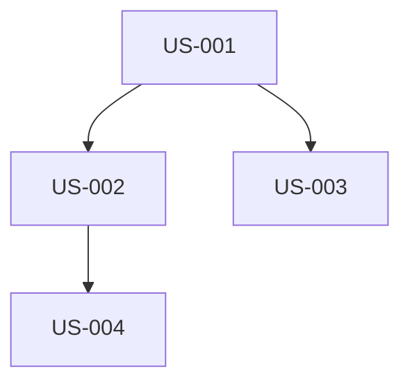

# {Feature Name} — Product Requirements Document

## 1. 개요 (Overview)

### 1-1. 배경 (Background)

- 이 기능이 필요한 이유
- 현재 문제점 또는 기회

### 1-2. 목표 (Goals)

- 이 기능으로 달성하고자 하는 것

### 1-3. 비목표 (Non-Goals)

- 이번 스코프에서 명시적으로 제외하는 것

---

## 2. 사용자 (Users)

### 2-1. 대상 사용자

- 주요 사용자 역할 및 특성

### 2-2. 사용자 시나리오

- 핵심 사용 흐름

---

## 3. 기능 요구사항 (Functional Requirements)

| ID     | 요구사항   | 우선순위 | 구현 가능 여부 | 비고                  |
| ------ | ---------- | -------- | -------------- | --------------------- |
| FR-001 | {요구사항} | Must     | 자동화         |                       |
| FR-002 | {요구사항} | Should   | 부분 자동화    | {수동 작업 필요 항목} |
| FR-003 | {요구사항} | Could    | 수동 필요      | {상세 가이드라인}     |

---

## 4. 비기능 요구사항 (Non-Functional Requirements)

- 성능, 보안, 접근성, i18n 등

---

## 5. 비즈니스 규칙 (Business Rules)

### 5-1. 핵심 비즈니스 규칙

| ID     | 규칙     | 조건        | 결과        | 예외 처리      |
| ------ | -------- | ----------- | ----------- | -------------- |
| BR-001 | {규칙명} | {적용 조건} | {기대 결과} | {예외 시 동작} |

### 5-2. 유효성 검증 규칙

- 입력 데이터의 유효성 검증 조건
- 필수/선택 필드 정의

### 5-3. 권한 및 접근 제어

- 역할별 접근 권한
- 데이터 가시성 규칙

---

## 6. 사용자 플로우 (User Flows)

### 6-1. 핵심 플로우 (Happy Path)

```
1. 사용자가 {시작 지점}에 진입
2. {액션 1} 수행
3. 시스템이 {반응 1} 표시
4. {액션 2} 수행
5. {최종 결과} 확인
```

### 6-2. 대안 플로우 (Alternative Paths)

- {대안 시나리오 1}: {조건} → {다른 경로}
- {대안 시나리오 2}: {조건} → {다른 경로}

### 6-3. 에러 플로우 (Error Paths)

- {에러 시나리오 1}: {원인} → {사용자에게 보이는 메시지/화면}
- {에러 시나리오 2}: {원인} → {복구 방법}

---

## 7. UI/UX 설계 (UI/UX Design)

### 7-1. 페이지 구조

- 라우팅, 레이아웃

### 7-2. 컴포넌트 구성

- 주요 UI 컴포넌트 목록 및 역할

### 7-3. Figma 참조

- Figma URL (있으면)

### 7-4. 디자인 필요 화면 (Design Required Screens)

> 새로운 화면이 필요한 FR을 식별한다. 각 화면에 대해 `design-guidelines.md`에 상세 가이드라인을 별도 작성한다.

| 화면 ID | 화면명   | 관련 FR | 디자인 유형         | 비고 |
| ------- | -------- | ------- | ------------------- | ---- |
| SCR-001 | {화면명} | FR-001  | 신규 화면           |      |
| SCR-002 | {화면명} | FR-002  | 기존 화면 대폭 개편 |      |

- **디자인 유형**: 신규 화면 / 기존 화면 대폭 개편 / 기존 화면 소규모 변경(가이드라인 불필요)
- 기존 화면 소규모 변경은 디자인 가이드라인 작성 대상에서 제외

---

## 8. 비자동화 항목 (Manual Tasks)

- [ ] {수동으로 수행해야 하는 항목 1}
- [ ] {수동으로 수행해야 하는 항목 2}

---

## 9. 의존성 그래프 (Dependency Graph)


