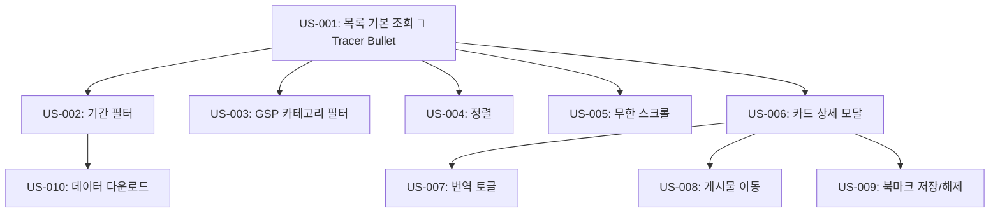

# User Stories — KTR 위클리 트렌드: 푸드 관심사

> 작성일: 2026-05-11  
> 상태: 사용자 승인 대기  
> 분해 방식: Vertical Slice + Tracer Bullet First

---

## 의존성 그래프



---

## US-001: 위클리 트렌드 푸드 관심사 목록 기본 조회 🎯 Tracer Bullet

> **역할**: 전체 플로우를 처음부터 끝까지 관통하는 핵심 Story

### User Story
As a **식품 업계 종사자**,  
I want to **KTR 위클리 트렌드 페이지에서 푸드 관심사 카드 목록을 조회하고 싶다**,  
So that **이번 주 SNS에서 주목받는 K-푸드 트렌드를 빠르게 파악할 수 있다**.

### Acceptance Criteria
- [ ] `/trend/k-trend-radar/weekly-trend` 경로 접근 시 페이지가 렌더링된다
- [ ] 메인탭 "위클리 트렌드" 활성 상태로 표시된다
- [ ] 서브탭 "푸드 관심사" 활성 상태로 표시된다
- [ ] **급상승 관심사** 섹션이 표시되며, 카드가 7열 그리드로 렌더링된다
- [ ] **SNS 관심사** 섹션이 표시되며, 카드가 7열 그리드로 렌더링된다
- [ ] 각 카드에 썸네일, 반응수(좋아요/댓글), 영문 설명, 날짜, 한국어 키워드가 표시된다
- [ ] 급상승 관심사 카드에 채널 로고, ⚡급상승 배지, GSP 카테고리 배지, 스파크라인 차트가 표시된다
- [ ] SNS 관심사 카드에 채널 로고, GSP 카테고리 배지가 표시되며 스파크라인·급상승 배지는 없다
- [ ] API 로딩 중 카드 영역에 스켈레톤 UI가 표시된다
- [ ] API 에러 시 에러 메시지와 재시도 버튼이 표시된다

### HITL / AFK
- **AFK** (자동화 가능) — 사용자 입력 없이 페이지 진입만으로 데이터 표시

### 개발 문서

#### 라우팅
```
/trend/k-trend-radar/weekly-trend
→ app/trend/k-trend-radar/weekly-trend/page.tsx (Next.js App Router)
```

#### 페이지 초기 데이터 페칭
```typescript
// app/trend/k-trend-radar/weekly-trend/page.tsx
// Server Component로 초기 데이터 페칭 권장 (SSR)
// 기본 파라미터: 최신 주차, 전체 카테고리, 최신 날짜순 정렬

const fetchWeeklyTrend = async (params: FilterParams) => {
  const res = await fetch(`/api/weekly-trend?${new URLSearchParams(params)}`);
  if (!res.ok) throw new Error('Failed to fetch');
  return res.json();
};
```

#### API 응답 구조 (추정)
```typescript
interface WeeklyTrendResponse {
  risingPosts: Post[];           // 급상승 관심사 (최대 14개)
  snsPosts: Post[];              // SNS 관심사 (첫 페이지)
  snsPostsTotal: number;         // 총 개수 (예: 1402)
  trendKeywordTop1: string;      // 트렌드 키워드 TOP 1
  currentWeekLabel: string;      // 예: "2026년 4월 3주"
  availableWeeks: WeekOption[];  // 기간 필터 선택지
  gspCategories: CategoryOption[]; // GSP 카테고리 선택지
}

interface Post {
  id: string;
  channel: string;
  channelLogoUrl: string;
  thumbnailUrl: string;
  captionOriginal: string;
  captionTranslated?: string;
  gspCategory: string;
  gspCategoryLabel: string;
  keywordTags: string[];
  isRising: boolean;
  trendStatus?: string;
  authorUsername: string;
  authorAvatarUrl: string;
  likeCount: number;
  commentCount: number;
  publishedAt: string;
  externalUrl: string;
  koreanTitle: string;
  sparklineData?: number[];  // 급상승 카드만 존재
  isBookmarked: boolean;
}
```

#### Zustand 스토어 설계
```typescript
// store/weeklyTrendStore.ts
interface WeeklyTrendStore {
  // 필터 상태
  weekRange: { startWeek: string; endWeek: string };
  gspCategory: string | null;
  sortBy: 'latest' | 'reaction';

  // 데이터
  risingPosts: Post[];
  snsPosts: Post[];
  snsPostsTotal: number;
  snsPage: number;
  isLoadingMore: boolean;

  // 모달
  selectedPost: Post | null;
  isModalOpen: boolean;

  // 액션
  setFilter: (filter: Partial<FilterState>) => void;
  setSortBy: (sort: 'latest' | 'reaction') => void;
  openModal: (post: Post) => void;
  closeModal: () => void;
  loadMoreSnsPosts: () => Promise<void>;
  toggleBookmark: (postId: string) => Promise<void>;
}
```

#### 컴포넌트 트리
```
WeeklyTrendPage
├── MainHeading (탭바)
├── SubHeading (서브탭 + 다운로드 버튼)
├── FilterBar
│   ├── WeekRangeSelect
│   ├── GspCategorySelect
│   └── SortingToggle
├── RisingSection (급상승 관심사)
│   ├── SectionTitle (키워드 TOP1 + 키워드 랭킹 버튼)
│   └── PostGrid
│       └── PostCard (× 14) — with sparkline
└── SnsSection (SNS 관심사)
    ├── SectionTitle (총 개수)
    ├── PostGrid
    │   └── PostCard (× N) — without sparkline
    └── InfiniteScrollTrigger
```

#### 스켈레톤 UI
```typescript
// 카드 그리드 로딩 중: 7×2 스켈레톤 카드 표시
// 각 스켈레톤 카드: 썸네일 placeholder + 텍스트 줄 placeholder
```

---

## US-002: 기간 필터로 주차별 데이터 조회

### User Story
As a **식품 업계 종사자**,  
I want to **특정 주차를 선택해 해당 주의 트렌드 데이터를 보고 싶다**,  
So that **과거 주차와 비교하며 트렌드 변화를 분석할 수 있다**.

### Acceptance Criteria
- [ ] 기간 필터 클릭 시 주차 선택 드롭다운이 표시된다
- [ ] 선택 가능한 주차 목록이 API에서 제공된다
- [ ] 주차 선택 시 해당 주 레이블이 필터 버튼에 표시된다 (예: "2026년 4월 3주")
- [ ] 주차 선택 즉시 서버에 API 재요청이 발생하고 목록이 갱신된다
- [ ] 갱신 중 스켈레톤 UI가 표시된다

### HITL / AFK
- **HITL** — 사용자가 주차를 직접 선택

### 개발 문서

#### 필터 변경 시 API 재요청 흐름
```typescript
// FilterBar > WeekRangeSelect
const onWeekChange = (weekRange: WeekRange) => {
  setFilter({ weekRange });           // Zustand 상태 업데이트
  fetchWeeklyTrend({ weekRange, ... }); // API 재요청
};
```

#### WeekRangeSelect 컴포넌트
```typescript
interface WeekOption {
  value: string;     // "2026-W14"
  label: string;     // "2026년 4월 3주"
}
// SelectMenu 디자인 시스템 컴포넌트 사용
// w=300px, h=40px, bg=#f6f7f8, radius=6px, 달력 아이콘
```

---

## US-003: GSP 카테고리 필터로 음식 분류별 조회

### User Story
As a **식품 업계 종사자**,  
I want to **특정 GSP 카테고리(음식 분류)만 필터링해서 보고 싶다**,  
So that **관심 있는 음식 카테고리의 트렌드만 집중해서 볼 수 있다**.

### Acceptance Criteria
- [ ] GSP 카테고리 드롭다운에 API에서 제공된 카테고리 목록이 표시된다
- [ ] 기본값은 "전체"(전체 카테고리)
- [ ] 카테고리 선택 즉시 서버 API 재요청 및 목록 갱신
- [ ] 선택된 카테고리명이 필터 버튼에 표시된다
- [ ] 결과 0건 시 빈 상태 안내 메시지 표시

### HITL / AFK
- **HITL** — 사용자가 카테고리를 직접 선택

### 개발 문서

#### GspCategorySelect 컴포넌트
```typescript
interface CategoryOption {
  value: string;   // 내부 코드 (예: "noodle")
  label: string;   // 표시명 (예: "Noodle")
}
// 단일 선택, 선택 해제 불가 (전체 선택 시 null)
// SelectMenu 디자인 시스템 컴포넌트 사용
// w=300px, h=40px, bg=#f6f7f8, radius=6px, chevron 아이콘
```

#### 빈 상태 처리
```typescript
// risingPosts.length === 0 && snsPosts.length === 0
// → "선택한 조건에 맞는 결과가 없습니다" 안내 + 필터 초기화 버튼
```

---

## US-004: 정렬 변경 (최신순 / 반응량순)

### User Story
As a **식품 업계 종사자**,  
I want to **카드 목록을 최신 날짜순 또는 반응량 높은순으로 정렬하고 싶다**,  
So that **가장 최신이거나 가장 인기 있는 게시물을 우선 확인할 수 있다**.

### Acceptance Criteria
- [ ] 기본 정렬은 "최신 날짜순" (Bold 표시)
- [ ] 정렬 토글 클릭 시 "반응량 높은순"으로 전환 (Bold↔Regular 교체)
- [ ] 정렬 변경 시 서버 API 재요청 및 목록 갱신
- [ ] 급상승 관심사 섹션과 SNS 관심사 섹션 모두 동일 정렬 적용

### HITL / AFK
- **HITL** — 사용자가 정렬 토글 클릭

### 개발 문서

#### SortingToggle 컴포넌트
```typescript
// 현재 선택: Bold 14px #2c3244
// 미선택: Regular 14px #7e8896
// | 구분선: Divider 컴포넌트 (vertical)
// 우측: 정렬 기준 설명 툴팁 (?) 아이콘

const sortOptions = [
  { value: 'latest', label: '최신 날짜순' },
  { value: 'reaction', label: '반응량 높은순' },
];
```

---

## US-005: SNS 관심사 목록 무한 스크롤

### User Story
As a **식품 업계 종사자**,  
I want to **SNS 관심사 카드를 스크롤하면 자동으로 더 불러오고 싶다**,  
So that **1,400개 이상의 게시물을 페이지 이동 없이 자연스럽게 탐색할 수 있다**.

### Acceptance Criteria
- [ ] 초기 로딩 시 첫 N개 카드 표시 (백엔드 협의 필요)
- [ ] 목록 하단 Intersection Observer 트리거 요소가 뷰포트에 진입하면 추가 로딩
- [ ] 추가 로딩 중 하단 스피너 표시
- [ ] 추가 로딩 성공 시 기존 목록 하단에 카드 추가 (중복 없음)
- [ ] 마지막 페이지 도달 시 스피너 숨김, "모든 결과를 불러왔습니다" 표시
- [ ] 필터/정렬 변경 시 목록 초기화 후 1페이지부터 재로딩

### HITL / AFK
- **AFK** — 스크롤만으로 자동 실행

### 개발 문서

#### Intersection Observer 구현
```typescript
// components/InfiniteScrollTrigger.tsx
const InfiniteScrollTrigger = ({ onIntersect, isLoading, hasMore }) => {
  const ref = useRef(null);

  useEffect(() => {
    const observer = new IntersectionObserver(
      ([entry]) => {
        if (entry.isIntersecting && !isLoading && hasMore) {
          onIntersect();
        }
      },
      { threshold: 0.1 }
    );
    if (ref.current) observer.observe(ref.current);
    return () => observer.disconnect();
  }, [isLoading, hasMore, onIntersect]);

  return (
    <div ref={ref}>
      {isLoading && <Spinner />}
      {!hasMore && <p>모든 결과를 불러왔습니다</p>}
    </div>
  );
};
```

#### 페이지네이션 API 파라미터
```typescript
// GET /api/weekly-trend/sns-posts
// Query: page=1&pageSize=21&weekRange=...&gspCategory=...&sortBy=latest
interface SnsPostsResponse {
  posts: Post[];
  total: number;
  page: number;
  pageSize: number;
  hasMore: boolean;
}
```

---

## US-006: 카드 클릭으로 상세 모달 조회

### User Story
As a **식품 업계 종사자**,  
I want to **카드를 클릭하면 게시물 원문과 트렌드 차트를 모달로 보고 싶다**,  
So that **목록을 벗어나지 않고 게시물 상세 정보를 빠르게 확인할 수 있다**.

### Acceptance Criteria
- [ ] 카드 클릭 시 오버레이 모달이 표시된다 (URL 변경 없음)
- [ ] 모달 좌측에 게시물 썸네일 이미지 전체가 표시된다
- [ ] 모달 우측에 유저명, 게시물 원문(영문), 반응수, 날짜가 표시된다
- [ ] 채널 배지, 급상승 배지(해당 시), 키워드 태그 pills가 표시된다
- [ ] 트렌드 차트(주별 반응량 라인 차트)가 표시된다
- [ ] X 버튼 또는 모달 외부 클릭 시 모달이 닫힌다
- [ ] 모달 열린 상태에서 배경 스크롤이 잠긴다

### HITL / AFK
- **HITL** — 사용자가 카드 클릭

### 개발 문서

#### 모달 상태 관리 (Zustand)
```typescript
// store/weeklyTrendStore.ts
openModal: (post: Post) => set({ selectedPost: post, isModalOpen: true }),
closeModal: () => set({ selectedPost: null, isModalOpen: false }),
```

#### 모달 컴포넌트 구조
```typescript
// components/PostDetailModal.tsx
// - Dialog/Modal 래퍼 (backdrop + 포커스 트랩)
// - 좌측:  썸네일 (object-cover, 전체 높이)
// - 우측: ScrollArea (내용 길 경우 스크롤)
//   - UserInfo (아바타 + username + ... 버튼)
//   - CaptionArea (원문 + 번역 토글)
//   - ReactionInfo (좋아요수, 댓글수, 날짜)
//   - TrendStatusBadge ("Emerging" 등)
//   - BadgeRow (채널 + 급상승 + 키워드 pills)
//   - TrendChart (라인 차트)
//   - CTARow ([저장] + [게시물 이동])
```

#### 배경 스크롤 잠금
```typescript
// 모달 open 시: document.body.style.overflow = 'hidden'
// 모달 close 시: document.body.style.overflow = ''
```

#### 트렌드 차트
```typescript
// 라인 차트: x축 주차(string), y축 반응량(number)
// 라이브러리: 개발팀 선택 (Recharts / Chart.js — 미결)
// 데이터: Post 응답에 포함 또는 별도 API 호출 (백엔드 협의 필요)
interface TrendPoint {
  week: string;   // "Jan W3, 2026"
  value: number;
}
```

---

## US-007: 게시물 번역 보기 (한국어)

### User Story
As a **식품 업계 종사자**,  
I want to **영문 게시물 원문을 한국어로 번역해서 보고 싶다**,  
So that **영어에 익숙하지 않아도 게시물 내용을 파악할 수 있다**.

### Acceptance Criteria
- [ ] 모달 우측에 "번역 보기 (한국어)" 링크가 표시된다
- [ ] 클릭 시 영문 원문이 한국어 번역 텍스트로 교체된다
- [ ] 번역 표시 중 "원문 보기" 링크가 표시된다
- [ ] "원문 보기" 클릭 시 영문 원문으로 복귀
- [ ] 추가 API 호출 없음 (번역 데이터는 Post API 응답에 포함)
- [ ] 번역 데이터가 없는 게시물의 경우 "번역 보기" 링크를 숨긴다

### HITL / AFK
- **HITL** — 사용자가 번역 링크 클릭

### 개발 문서

```typescript
// components/CaptionArea.tsx
const [showTranslation, setShowTranslation] = useState(false);
const hasTranslation = !!post.captionTranslated;

return (
  <>
    <p>{showTranslation ? post.captionTranslated : post.captionOriginal}</p>
    {hasTranslation && (
      <button onClick={() => setShowTranslation(!showTranslation)}>
        {showTranslation ? '원문 보기' : '번역 보기 (한국어)'}
      </button>
    )}
  </>
);
// 스타일: 파란색 텍스트 링크 (#1e6eff)
```

---

## US-008: 게시물 이동 (외부 SNS 링크)

### User Story
As a **식품 업계 종사자**,  
I want to **원본 SNS 게시물로 이동하고 싶다**,  
So that **원본 게시물의 댓글, 공유 등 전체 맥락을 확인할 수 있다**.

### Acceptance Criteria
- [ ] 모달 하단 "게시물 이동" 버튼이 표시된다
- [ ] 클릭 시 `externalUrl`을 새 탭으로 오픈한다 (`target="_blank"`, `rel="noopener noreferrer"`)
- [ ] `externalUrl`이 없는 경우 버튼이 비활성화된다

### HITL / AFK
- **HITL** — 사용자가 버튼 클릭

### 개발 문서

```typescript
// components/CTARow.tsx
<a
  href={post.externalUrl}
  target="_blank"
  rel="noopener noreferrer"
  aria-disabled={!post.externalUrl}
>
  게시물 이동
</a>
```

---

## US-009: 북마크 저장 / 해제

### User Story
As a **로그인한 식품 업계 종사자**,  
I want to **관심 있는 게시물을 북마크 저장하고 싶다**,  
So that **나중에 다시 찾지 않고 저장한 게시물 목록에서 빠르게 확인할 수 있다**.

### Acceptance Criteria
- [ ] 카드 우상단 북마크 아이콘이 저장 여부에 따라 filled/outline으로 표시된다
- [ ] 모달 하단 "저장" 버튼도 동일 상태 반영
- [ ] 북마크 클릭(저장) → 서버 API 호출 → 성공 시 아이콘 즉시 filled 전환
- [ ] 북마크 클릭(해제) → 서버 API 호출 → 성공 시 아이콘 즉시 outline 전환
- [ ] API 실패 시 에러 토스트, 아이콘 상태 원복
- [ ] 페이지 새로고침 후에도 저장 상태가 유지된다 (서버 저장)
- [ ] 비로그인 상태에서 클릭 시 로그인 유도 처리 (기존 인증 플로우 따름)

### HITL / AFK
- **HITL** — 사용자가 북마크 클릭

### 개발 문서

#### Zustand 액션
```typescript
toggleBookmark: async (postId: string) => {
  const post = findPost(postId);
  const prevState = post.isBookmarked;

  // Optimistic update
  updatePostBookmark(postId, !prevState);

  try {
    if (prevState) {
      await api.delete(`/api/bookmarks/${postId}`);
    } else {
      await api.post(`/api/bookmarks`, { postId });
    }
  } catch (e) {
    // 실패 시 원복
    updatePostBookmark(postId, prevState);
    showToast('저장에 실패했습니다. 다시 시도해주세요.', 'error');
  }
}
```

#### API 엔드포인트 (추정)
```
POST   /api/bookmarks        { postId }     → 저장
DELETE /api/bookmarks/:postId               → 해제
```

#### 북마크 아이콘 상태
```typescript
// 저장: filled bookmark 아이콘
// 미저장: outline bookmark 아이콘
// drop-shadow: 0px 1px 2px rgba(10,10,10,0.05)
```

---

## US-010: 현재 필터 기준 데이터 다운로드

### User Story
As a **데이터 분석가**,  
I want to **현재 필터 기준의 데이터를 파일로 다운로드하고 싶다**,  
So that **주간 트렌드 리포트 작성에 활용할 수 있다**.

### Acceptance Criteria
- [ ] SubHeading 우측 "데이터 다운로드" 버튼이 표시된다
- [ ] 클릭 시 현재 적용된 기간/카테고리 필터 기준 데이터 파일이 다운로드된다
- [ ] 다운로드 진행 중 버튼이 로딩 상태로 표시된다 (중복 클릭 방지)
- [ ] 다운로드 완료 시 파일이 자동 저장된다
- [ ] 다운로드 실패 시 에러 토스트가 표시된다
- [ ] 파일 형식: CSV 또는 Excel (백엔드 협의 필요 — 미결)

### HITL / AFK
- **HITL** — 사용자가 버튼 클릭

### 개발 문서

```typescript
// components/DownloadButton.tsx
const [isDownloading, setIsDownloading] = useState(false);

const handleDownload = async () => {
  if (isDownloading) return;
  setIsDownloading(true);
  try {
    const params = getFilterParams(); // Zustand에서 현재 필터 읽기
    const res = await fetch(`/api/weekly-trend/download?${new URLSearchParams(params)}`);
    if (!res.ok) throw new Error();
    const blob = await res.blob();
    const url = URL.createObjectURL(blob);
    const a = document.createElement('a');
    a.href = url;
    a.download = `weekly-trend-${params.weekRange}.csv`; // 파일명 협의 필요
    a.click();
    URL.revokeObjectURL(url);
  } catch {
    showToast('다운로드에 실패했습니다.', 'error');
  } finally {
    setIsDownloading(false);
  }
};

// 버튼 스타일: ↓ 아이콘 + "데이터 다운로드"
// border 1px #dce0e5, radius 6px, h=40px, Medium 14px
```

---

## 구현 순서 (권장)

| 순서 | Story | 이유 |
|------|-------|------|
| 1 | US-001 | Tracer Bullet — 전체 플로우 검증 |
| 2 | US-005 | 무한 스크롤 — 목록 기본 동작 완성 |
| 3 | US-002 | 기간 필터 — 핵심 사용자 인터랙션 |
| 4 | US-003 | 카테고리 필터 |
| 5 | US-004 | 정렬 |
| 6 | US-006 | 상세 모달 — 2번째 핵심 화면 |
| 7 | US-007 | 번역 토글 (모달 의존) |
| 8 | US-008 | 게시물 이동 (모달 의존) |
| 9 | US-009 | 북마크 |
| 10 | US-010 | 데이터 다운로드 |

---

## 미결 사항

| 항목 | 내용 |
|------|------|
| 트렌드 차트 라이브러리 | Recharts / Chart.js — 개발팀 선택 |
| 다운로드 파일 형식 | CSV vs Excel — 백엔드 협의 |
| 무한 스크롤 pageSize | 14개 vs 21개 — 백엔드 협의 |
| 키워드 랭킹 버튼 라우팅 | 이동할 경로 확인 필요 |
| 모달 트렌드 차트 데이터 | Post 응답 포함 vs 별도 API — 백엔드 협의 |
| 비로그인 북마크 처리 | 기존 인증 플로우 확인 필요 |
